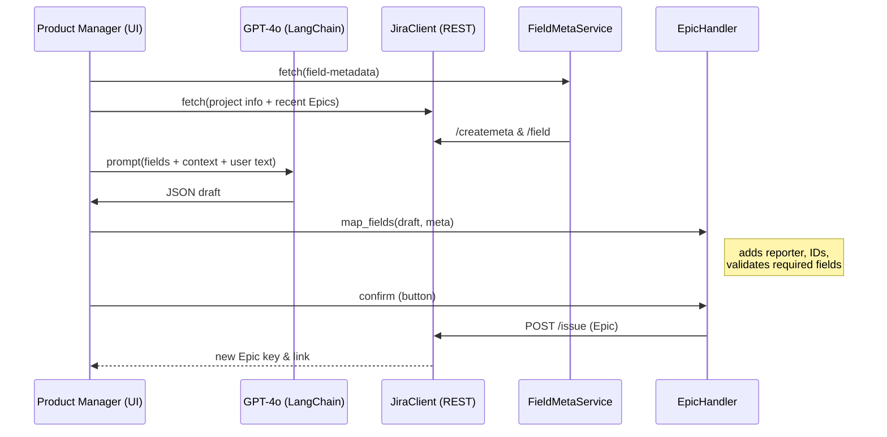

# AI-Driven Epic Creator – Project Documentation

*(Version 0.1 – June 2025)*

---

## 1  What this tool is

**AI-Driven Epic Creator** is a Python package + Streamlit GUI that lets product managers generate production-ready **Jira Epics** from a short natural-language prompt, review / edit the draft, and push the final issue straight to Jira Cloud—no hard-coded field IDs, no copy-paste.

---

## 2  Why we built it

* **PM frustration:** writing every Epic by hand, hunting custom-field IDs.
* **Field drift:** Jira instances differ; custom fields come and go.
* **AI leverage:** GPT-4o can draft a well-structured Epic in seconds—if given the right context and constraints.
* **Compliance:** Push-protection forbids secrets in Git history.
* **Human-in-loop:** PMs must keep final control before anything hits Jira.

---

## 3  How it works – request → Jira



---

## 4  Key components

| Layer                     | File                       | Responsibility                                                                                                                      |
| ------------------------- | -------------------------- | ----------------------------------------------------------------------------------------------------------------------------------- |
| **Jira REST wrapper**     | `jiraClient.py`            | `get` / `post` with retries & token auth (`tenacity`).                                                                              |
| **FieldMetadataService**  | `services/field_meta.py`   | Dynamically discovers **all** fields for Epic issuetype via `/issue/createmeta/{project}/issuetypes/{id}` and merges with `/field`. |
| **FeatureContextService** | `services/context.py`      | Pulls project summary + last N Epics for prompt grounding.                                                                          |
| **LLMService**            | `services/llm.py`          | Builds composite prompt, runs GPT-4o through LangChain, parses JSON via `JsonOutputParser` → `EpicOutput` (Pydantic).               |
| **EpicCreationHandler**   | `services/epic_handler.py` | Case-insensitive map of human keys → Jira fieldIDs, type-aware fixes (dates, labels, reporter), then POST `/issue`.                 |
| **Orchestrator**          | `orchestrator.py`          | One public function `create_epic_from_prompt(project, prompt)` for CLI/GUI.                                                         |
| **Streamlit UI**          | `streamlit_epic.py`        | Credentials & prompt → generate draft → editable form → push button.                                                                |

---

## 5  Important design choices

1. **Source-layout** (`src/epic_creator`) + `pyproject.toml` at repo root.
2. **Dynamic field discovery** – no custom-field ID hard-coding; works across Jira sites.
3. **Case-insensitive mapping** – LLM keys can be `summary`, `Summary`, `Summary `.
4. **Secret-safe repo** – `.env` is in `.gitignore`; earlier leak removed with `git filter-repo`.
5. **Retry logic** for transient Jira errors (429/5xx) via `tenacity`.
6. **Human-in-loop** – Streamlit form enforces required fields before final push.

---

## 6  Setup & running

```bash
# 1. clone & create env
git clone https://github.com/YOUR_ORG/ai-epic-creator.git
cd ai-epic-creator
conda create -n jira-maker python=3.11 pip
conda activate jira-maker
pip install -e .        # installs package in editable mode
pip install streamlit python-dotenv

# 2. copy secrets
cp .env.example .env
#   edit JIRA_BASE_URL, JIRA_EMAIL, JIRA_API_TOKEN, OPENAI_API_KEY

# 3. Run CLI (quick check)
python -m epic_creator.orchestrator

# 4. Run Streamlit UI
streamlit run streamlit_epic.py
```

---

## 7  Field-type handling table

| Jira schema type | How handler stores | Example                             |
| ---------------- | ------------------ | ----------------------------------- |
| `string`         | string             | `"summary": "Ship v1"`              |
| `date`           | ISO 8601           | `"duedate": "2025-07-15"`           |
| `array[string]`  | list\[str]         | `"labels": ["mvp","video-gen"]`     |
| `priority`       | object             | `"priority": {"name": "High"}`      |
| `user`           | object             | `"reporter": {"id": "<accountId>"}` |

---

## 8  Extending ideas

* **Dropdowns fed from `allowedValues`** for Streamlit form.
* **CI pipeline** – pytest + secret-scan pre-commit.
* **Dockerfile** for easy deployment inside corporate VPC.
* **Task automation** – schedule GPT upgrades or nightly validation of field metadata.

---

## 9  Frequently asked questions

| Question                                                                   | Answer                                                                                                            |
| -------------------------------------------------------------------------- | ----------------------------------------------------------------------------------------------------------------- |
| *Why not `/rest/api/2/issue/createmeta?expand=fields` like older scripts?* | Atlassian cloud sometimes omits fields; the single-issue-type v3 endpoint is reliable.                            |
| *How do I change the LLM model?*                                           | Pass `model_name="gpt-4o"` when instantiating `LLMService` or set `OPENAI_MODEL` env var.                         |
| *What happens if the LLM omits a required custom field?*                   | `EpicCreationHandler.map_fields` raises `ValueError` before POST; the UI shows the error and the field turns red. |
| *Can we skip Streamlit and call from Slack?*                               | Yes—wrap `create_epic_from_prompt` in a slash-command; reuse `FieldMetadataService` + validation logic.           |

---

© 2025 Abhinav Singh Chauhan — MIT License